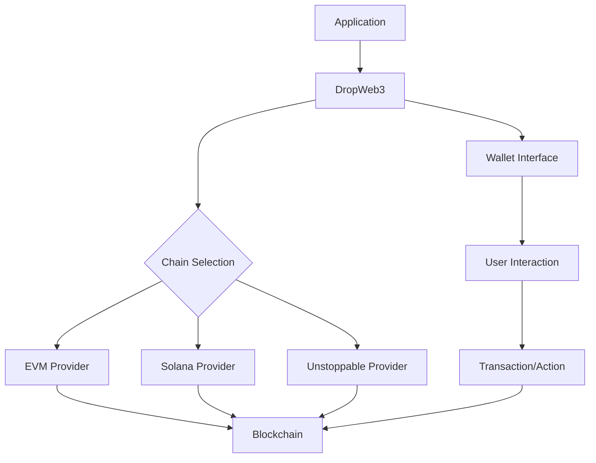

# Architecture Overview

## System Components

### 1. Core Components

#### DropWeb3 Class
The central orchestrator that manages blockchain interactions across different networks. It provides:
- Network configuration management
- Chain provider instantiation
- Wallet integration
- API communication setup

#### Chain Providers
Abstract implementations for different blockchain networks:
- EVMProvider: Handles EVM-compatible chains (Ethereum, BSC, Polygon, etc.)
- SolanaProvider: Manages Solana blockchain interactions
- UnstoppableProvider: Handles Unstoppable Domains integration

### 2. Infrastructure

#### Network Layer
- HTTP client (ky) for API communication
- Configurable endpoints for different environments (Testnet/Mainnet)
- Blockchain RPC connections

#### Wallet Integration
- Multiple wallet support (MetaMask, Phantom, Unstoppable)
- Wallet detection and connection
- Transaction signing and message signing
- Account management

## Design Patterns

### 1. Provider Pattern
- Abstract chain provider interface (IChainProvider)
- Concrete implementations for different chains
- Consistent interface across different blockchain implementations

### 2. Factory Pattern
- Chain provider factory in DropWeb3 class
- Dynamic provider instantiation based on configuration
- Extensible design for adding new chains

### 3. Singleton Pattern
- AppKitProvider implementation
- Shared modal and wallet management
- Consistent state across the application

## Integration Points

### 1. External Services
```typescript
interface ExternalIntegrations {
  API: {
    testnet: 'https://apiv3dev.droplinked.com'
    mainnet: 'https://apiv3.droplinked.com'
    local: 'http://127.0.0.1'
  }
  Blockchain: {
    EVM: string[]      // RPC endpoints
    Solana: string[]   // Cluster endpoints
    Other: string[]    // Additional chain endpoints
  }
}
```

### 2. Smart Contract Integration
- NFT Contract interactions
- Shop Contract interactions
- Custom contract deployment
- Transaction management

### 3. Wallet Integration Points
```typescript
interface WalletIntegration {
  connect(): Promise<void>
  disconnect(): Promise<void>
  signMessage(message: string): Promise<string>
  signTransaction(tx: Transaction): Promise<string>
}
```

## Data Flow



## Security Considerations

### 1. Authentication
- Message signing for wallet verification
- Nonce-based authentication
- Timestamp validation

### 2. Transaction Security
- Gas estimation and limits
- Transaction confirmation monitoring
- Error handling and recovery

### 3. Data Protection
- Private key management
- Secure RPC connections
- API endpoint security

## Extensibility

### 1. Adding New Chains
1. Implement chain provider interface
2. Add chain configuration
3. Update chain mapping
4. Implement required methods

### 2. Custom Features
- Custom wallet integration
- Additional contract support
- Extended functionality through plugins

## Performance Optimization

### 1. Caching Strategy
- Provider instance caching
- Contract ABI caching
- Network response caching

### 2. Batch Processing
- Transaction batching
- Event aggregation
- Bulk operations optimization

## Error Handling

### 1. Custom Exceptions
- WalletNotFoundException
- ChainNotImplementedException
- SignatureRequestDeniedException
- Others as needed

### 2. Recovery Mechanisms
- Transaction retry logic
- Fallback providers
- Error reporting and logging 